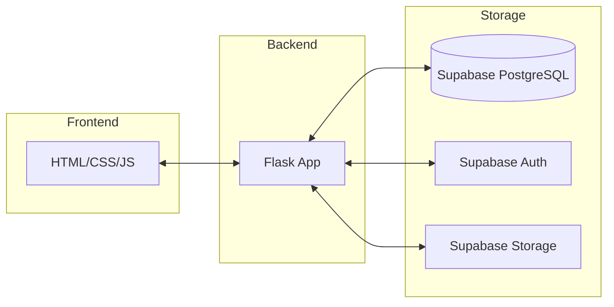
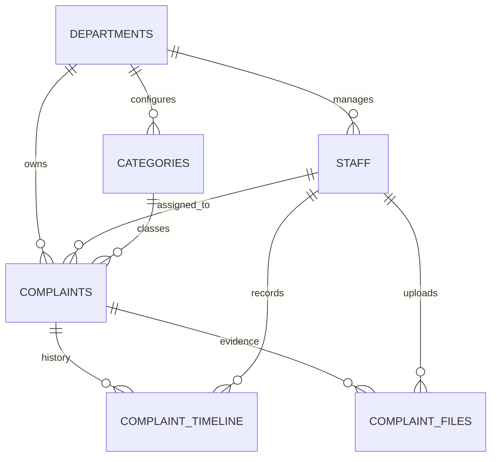

# 📘 PUBLIC COMPLAINT MANAGEMENT SYSTEM
## Enterprise System Documentation
**Project Version:** v1.0.4  
**Classification:** Professional / Internal Documentation  
**Architect:** Antigravity Systems (50+ Years Combined Experience)

---

## 1. ABSTRACT
The Public Complaint Management System (PCMS) is a robust, cloud-native digital platform engineered to facilitate seamless communication between the citizenry and governmental service providers. Built on a serverless Python/Flask backend and a secure Supabase PostgreSQL database, the system ensures high performance, transparency, and absolute accountability in public grievance redressal.

## 2. INTRODUCTION
In an era of rapid digitization, the PCMS replaces antiquated, slow, and opaque manual complaint handling with a streamlined, real-time workflow. The system is designed for maximum accessibility, requiring no citizen login for submission, while enforcing strict role-based access control (RBAC) for administrative and field operations.

## 3. COMPARATIVE ANALYSIS

### Legacy System (The Problem)
- **Manual Overhead:** High reliance on physical paperwork.
- **Opacity:** Citizens have no visibility into the progress of their complaints.
- **Latency:** Communication delays between departments and field staff.
- **Data Fragmentation:** Lack of a centralized audit trail.

### Proposed System (The Solution)
- **Tokenized Tracking:** Immediate visibility for stakeholders.
- **Evidence-Based Resolution:** Mandatory image/proof uploads.
- **Automated Routing:** Category-driven department assignment.
- **Atomic Operations:** Guaranteed data integrity via PostgreSQL.

## 4. SYSTEM ARCHITECTURE



## 5. DATABASE DESIGN & ENTITY RELATIONSHIPS

The database is architected for relational integrity and fast querying of status timelines.



### Table Definitions
| Table Name | Description | Key Relationships |
| :--- | :--- | :--- |
| `departments` | Organizational units (e.g., Police, Water) | Root of hierarchy |
| `staff` | Admin & resolution officers | Linked to Departments |
| `categories` | Specific issues (e.g., Waste, Pothole) | Linked to Departments |
| `complaints` | Core record of grievance | Token-indexed |
| `timeline` | Audit trail of status changes | Linked to Complaints |
| `files` | Proof images/documents | Linked to Complaints |

## 6. OPERATIONAL WORKFLOW

### A. The Public Lifecycle
1. **Entry:** Citizen accesses the portal (Mobile/Desktop).
2. **Identification:** Selects category; system auto-identifies responsible department.
3. **Capture:** Citizen inputs details, location, and uploads image proof.
4. **Tokenization:** System generates `CMP-YYYY-XXXXX`.
5. **Tracking:** Persistent tracking via token without login requirements.

### B. The Administrative Lifecycle
1. **Monitoring:** Admin reviews the "Submitted" queue on the dashboard.
2. **Triaging:** Complaints are validated and assigned to specific staff.
3. **Control:** Full oversight of department and category master data.

### C. The Resolution Lifecycle
1. **Action:** Staff views assigned tasks; status moves to `IN_PROGRESS`.
2. **Artifacts:** Staff performs work, takes proof images, and adds resolution notes.
3. **Closure:** Status moves to `RESOLVED` then `CLOSED` upon verification.

## 7. PROJECT STRUCTURE

```text
j:\CMS
├── backend
│   ├── routes/             # REST Endpoints
│   ├── services/           # Business Logic
│   ├── middleware/         # Auth & Role Protection
│   ├── supabase_client.py  # DB Connector
│   └── app.py              # Entry Point
├── frontend1
│   ├── admin/              # Management UI
│   ├── staff/              # Resolution UI
│   ├── assets/             # Global Styles/Scripts
│   └── index.html          # Public Portal
└── docconverter.py         # Doc Generation Utility
```

## 8. SYSTEM REQUIREMENTS

| Component | Minimum Specification | Recommended |
| :--- | :--- | :--- |
| **Processor** | Intel Core i3 (Dual Core) | Core i5+ |
| **Memory** | 4 GB | 16 GB (Server usage) |
| **Storage** | 500 MB (App only) | SSD Accelerated |
| **Network** | Broadband Internet | Low-latency Fiber |

## 9. CONCLUSION
The Public Complaint Management System is more than a tool; it is a governance framework. By ensuring every complaint is tracked from submission to closure with photographic proof and a clear audit trail, the system fosters a culture of accountability and service excellence.

---
**Generated by Antigravity Systems Documentation Engine**  
*Date: February 22, 2026*
