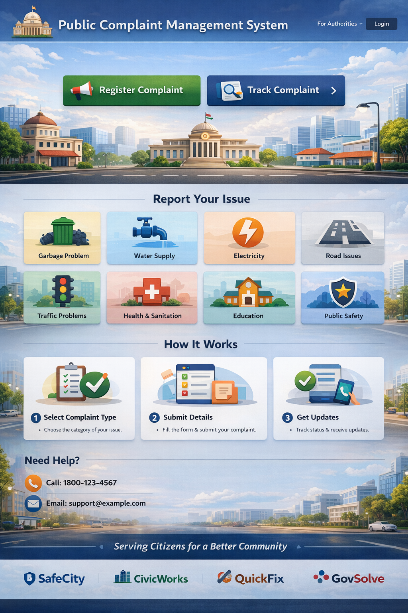
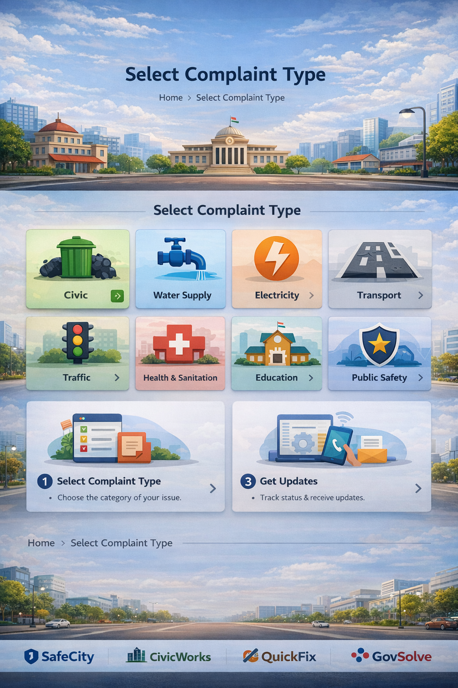
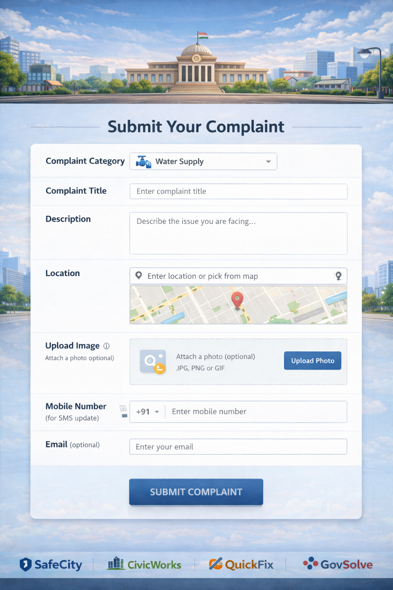
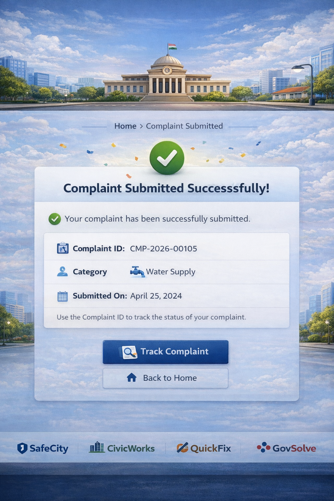
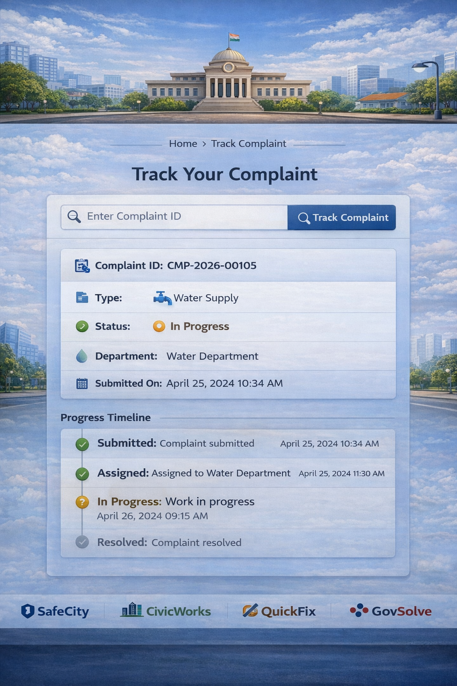
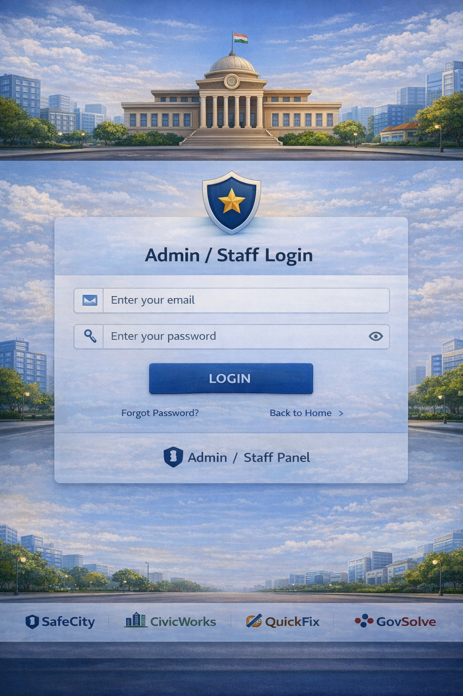

# 🏙️ Public Complaint Management System (PCMS)

[](https://opensource.org/licenses/MIT)
[](https://www.python.org/downloads/)
[](https://flask.palletsprojects.com/)
[](https://supabase.com/)

## 📝 Abstract
The **Public Complaint Management System (PCMS)** is a high-performance, cloud-native digital governance platform designed to bridge the gap between citizens and government departments. By replacing antiquated manual processes with a streamlined, real-time digital workflow, PCMS ensures transparency, accountability, and efficiency in public grievance redressal.

---

## ✨ Key Features

### 👤 Citizen Portal
- **Login-Free Submission:** Quick and accessible complaint filing without mandatory registration.
- **Evidence Upload:** Mandatory attachment of images/documents for every complaint.
- **Tokenized Tracking:** Real-time status tracking using unique IDs like `CMP-2026-X123`.

### 🛡️ Administrative Control (RBAC)
- **Role-Based Access:** Distinct portals for Admins and Staff.
- **Auto-Assignment:** Intelligent routing of complaints based on category and department load.
- **Audit Trails:** Comprehensive history of every action taken on a complaint.

### ⚙️ Master Data Management
- **Department Controls:** Define organizational units (Police, Water, Electricity).
- **Category Configuration:** Customizable categories for granular issue tracking.

---

## 🛠️ Technology Stack

| Layer | Technology |
| :--- | :--- |
| **Backend** | Python / Flask |
| **Database** | PostgreSQL (via Supabase) |
| **Authentication** | Supabase Auth (RBAC) |
| **Storage** | Supabase Storage (S3 Compatible) |
| **Frontend** | Vanilla HTML5, CSS3, JavaScript |
| **Styling** | Modern CSS with Glassmorphism & Neural themes |

---

## 🖼️ UI Showcase

The system features a premium, cinematic design with smooth interactions and responsive layouts.

| Snapshot 1 | Snapshot 2 | Snapshot 3 |
| :---: | :---: | :---: |
|  |  |  |

| Snapshot 4 | Snapshot 5 | Snapshot 6 |
| :---: | :---: | : :---: |
|  |  |  |

> [!TIP]
> View more designs and screenshots in the [uidesion/](./uidesion) folder.

---

## 📂 Project Structure

```text
j:\CMS
├── backend/            # Python/Flask Backend
│   ├── routes/         # API Endpoints
│   ├── services/       # Business Logic Layer
│   ├── middleware/     # Auth & Role Protection
│   └── .env            # Environment Configuration
├── frontend1/          # Web Interface
│   ├── admin/          # Admin Dashboard
│   ├── staff/          # Staff Management
│   ├── assets/         # Global CSS/JS/Images
│   └── index.html      # Public Entry Point
├── uidesion/           # Mockups & UI Assets
├── app.py              # Single-Command Starter
├── requirements.txt    # Dependency List
└── PROJECT_DOCUMENT_PROFESSIONAL.docx # Detailed Enterprise Documentation
```

---

## 🚀 Getting Started

Follow these steps to set up and run the project locally.

### 1️⃣ Clone the Repository
```bash
git clone https://github.com/JithinGK51/CMS.git
cd CMS
```

### 2️⃣ Prerequisites
Ensure you have **Python 3.8+** installed. Create a virtual environment:
```bash
python -m venv venv
# Windows
venv\Scripts\activate
# Linux/macOS
source venv/bin/activate
```

### 3️⃣ Configure Environment
Create a `.env` file inside the `backend/` directory with your Supabase credentials:
```env
SUPABASE_URL=your_supabase_url
SUPABASE_KEY=your_supabase_anon_key
SUPABASE_SERVICE_ROLE_KEY=your_service_role_key
```

### 4️⃣ Install Dependencies
```bash
pip install -r requirements.txt
```

### 5️⃣ Run the Application
The project includes a smart runner script that automatically checks dependencies and connections before starting.
```bash
python app.py
```
This will:
1. Verify all dependencies.
2. Check the Supabase database connection.
3. Start the Flask backend.
4. Open the frontend in your default browser.

---

## 👨‍💻 Internship Project
This project was developed as part of an intensive technical internship. It demonstrates full-stack engineering proficiency, database architecture skills, and modern UI/UX implementation.

---

## 📜 License
Licensed under the **MIT License**. See [LICENSE](LICENSE) for more details.

---
**Developed with ❤️ by Jithin GK**
